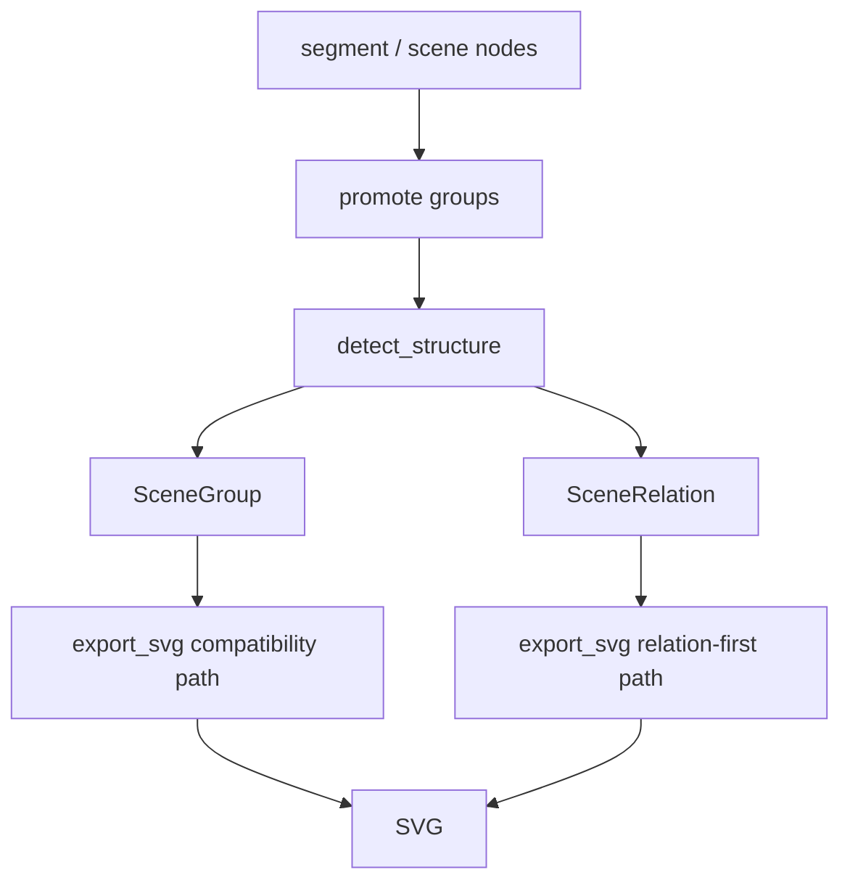

# 变更提案: relation_layer_refactor

## 元信息
```yaml
类型: 重构/修复
方案类型: implementation
优先级: P0
状态: 进行中
创建: 2026-03-11
```

---

## 1. 需求

### 背景
前三轮已经把坐标映射、样式恢复和局部 `fan` 导出补起来，但主样本 `picture/a22efeb2-370f-4745-b79c-474a00f105f4.png` 仍然存在结构失真。用户最新反馈已经从“颜色不对”转为“主体图形和线段都没正确识别”，说明瓶颈不再是 contour 阈值，而是缺少显式的实例关系表达。

参考 `AutoFigure-Edit` 与 `Edit-Banana` 的共同启发，本轮不继续堆叠局部启发式，而是补一个最小可落地的“关系层”：

- 检测阶段显式产出连接关系，而不是只把 stroke 留在 group 里
- 导出阶段优先消费关系，重建连接结构
- 测试阶段固定 fan / connector 的关系断言，避免再次回退到碎 path

### 目标
- 为 `SceneGraph` 增加最小关系模型，承载 fan / connector 连接信息
- 升级 `detect_structure`，让现有 fan 检测不止产生 group，也产生 relation
- 升级 `export_svg`，优先基于 relation 重建连接主干
- 针对 `./picture` 主样本补回归测试，确保左侧 fan 和基础 connector 不再退化

### 约束条件
```yaml
时间约束: 本轮先做最小关系层，不做全图元实例化重写
性能约束: 不引入外部训练依赖，不显著增加现有测试时间
兼容性约束: 现有 group/shape_type 导出语义保持可兼容，已有测试尽量少改
业务约束: 视觉还原优先于可编辑性；用户建议修改期间关闭 plot2svg-app
```

### 验收标准
- [ ] `SceneGraph` 可序列化 relations，且关系字段能表达 fan/backbone/source/target
- [ ] `detect_structure` 对 fan 结构同时产出 group 和 relation
- [ ] `export_svg` 对 fan 关系优先走 relation 渲染路径
- [ ] 主样本回归测试能断言至少一个 `fan` relation 和更明确的 connector 元数据
- [ ] `pytest -q` 保持全绿

---

## 2. 方案

### 技术方案
采用“最小关系层”方案，而不是全面重写实例系统。

第一步，在 `scene_graph.py` 中新增 `SceneRelation` 数据类，并让 `SceneGraph` 持有 `relations`。  
第二步，在 `detect_structure.py` 复用现有 fan 启发式，把原本只写入 `SceneGroup` 的结果同步落到 `SceneRelation`。  
第三步，在 `export_svg.py` 中优先消费 `fan` relation 进行主干渲染，并保留现有 group 作为兼容和元数据出口。  
第四步，在测试里新增 relation 断言和主样本回归断言，锁死行为。

### 影响范围
```yaml
涉及模块:
  - scene_graph: 新增 SceneRelation 数据模型与序列化
  - detect_structure: fan / connector 检测产出关系对象
  - export_svg: 优先基于 relation 重建连接结构
  - tests/test_scene_graph.py: 关系层序列化回归
  - tests/test_detect_structure.py: fan relation 单元测试
  - tests/test_pipeline.py: 主样本关系输出回归
  - .helloagents/context.md 等: 记录第四轮架构变更
预计变更文件: 8-12
```

### 风险评估
| 风险 | 等级 | 应对 |
|------|------|------|
| relation 与现有 group 语义重叠，导致导出分叉 | 中 | 先只让 fan 走 relation 优先，其他结构继续兼容 group |
| 新字段引发现有 JSON/测试断言变化 | 中 | 先补序列化测试，再做最小字段集 |
| 主样本回归不稳定，测试过于依赖具体 path | 高 | 断言关系存在和关键属性，不断言完整 SVG path 文本 |

---

## 3. 技术设计

### 架构设计


### 数据模型
| 字段 | 类型 | 说明 |
|------|------|------|
| id | str | relation 唯一标识 |
| relation_type | str | 关系类型，首批支持 `fan` |
| source_ids | list[str] | 关系源节点，如扇出源点 |
| target_ids | list[str] | 关系目标节点 |
| backbone_id | str\|None | 主干 stroke 节点 |
| group_id | str\|None | 关联 group，兼容旧逻辑 |
| metadata | dict[str, object] | 扩展方向、控制点等附加信息 |

---

## 4. 核心场景

### 场景: 左侧 Polygenic 扇出结构
**模块**: `detect_structure` / `export_svg`
**条件**: 检测到 tall stroke + 左侧对齐 source 圆点 + 右侧目标区域
**行为**: 生成 `fan` group，同时生成 `fan` relation，导出时优先走 relation 渲染
**结果**: 输出 SVG 不再退化为“单大 stroke + 若干散点”

### 场景: 基础 connector 回归
**模块**: `scene_graph` / `detect_structure`
**条件**: 普通 connector group 被识别为箭头或线段
**行为**: 保持现有 group 语义不退化，为后续 connector relation 扩展预留数据位
**结果**: 本轮不重写全部 connector，但不会阻塞后续扩展

---

## 5. 技术决策

### relation_layer_refactor#D001: 先引入最小 SceneRelation，而不是直接重写 SceneGroup
**日期**: 2026-03-11
**状态**: ✅采纳
**背景**: 现有 `SceneGroup` 已承担 role/shape_type/child_ids 等兼容职责，直接塞入复杂关系字段会让 group 继续膨胀，并把“实例聚合”和“连接关系”混为一谈。
**选项分析**:
| 选项 | 优点 | 缺点 |
|------|------|------|
| A: 扩展 SceneGroup | 改动表面更小 | 语义混乱，导出与检测继续强耦合 |
| B: 新增 SceneRelation | 语义清晰，可渐进迁移 relation-first 导出 | 需要补序列化与测试 |
**决策**: 选择方案 B
**理由**: 用户当前失败点集中在“连接关系无法正确识别”，关系对象是最小必要抽象，能够在不重写全部实例系统的前提下切入问题核心。
**影响**: `scene_graph`, `detect_structure`, `export_svg`, `tests`, `.helloagents` 文档同步更新
