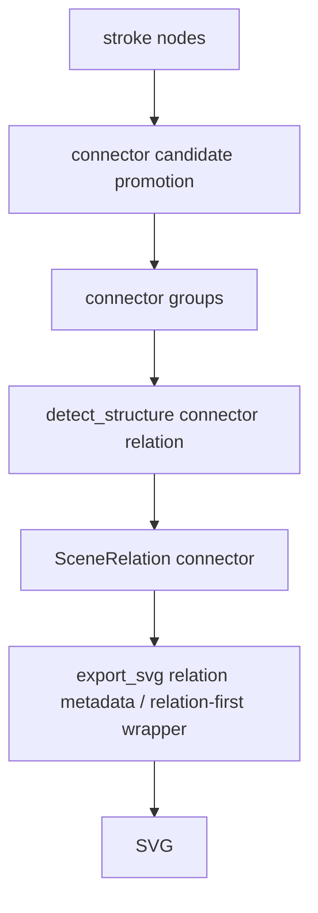

# 变更提案: connector_relation_refactor

## 元信息
```yaml
类型: 重构/修复
方案类型: implementation
优先级: P0
状态: 进行中
创建: 2026-03-11
```

---

## 1. 需求

### 背景
第四轮已经证明关系层链路本身可用，但它只覆盖了左侧 `fan`。从最新主样本输出来看，中部和右侧的大部分连接线仍停留在“裸 `stroke` 直接导出”阶段，导致：

- 对角线、折线、箭头链没有进入关系层
- 导出结果仍是碎 path 拼贴，而不是结构化连接
- 主体图形即使保留了填充轮廓，仍缺少和其他对象的明确关系表达

因此，本轮先不继续做主体实例化，而是按 `Connector First` 路线，把普通 connector 升级为显式 relation，并让导出层优先消费这些 relation。

### 目标
- 扩大 connector 候选识别范围，让对角线和折线 stroke 不再大量漏检
- 为普通 connector / arrow 生成 `SceneRelation`
- 在 SVG 导出中为 connector relation 增加 relation-first 元数据与渲染入口
- 用主样本回归确保 connector relation 数量明显高于当前 fan-only 状态

### 约束条件
```yaml
时间约束: 本轮只做 connector relation，不同时重写 Omnigenic 实例层
性能约束: 不引入新模型或训练流程，保持当前 pipeline 时长可接受
兼容性约束: 保留既有 group 输出，relation 作为新增优先层
业务约束: 视觉还原优先；修改期间建议关闭 plot2svg-app 以避免缓存旧输出
```

### 验收标准
- [ ] `promote_component_groups` 或 `detect_structure` 能覆盖更多对角/折线 connector 候选
- [ ] `detect_structure` 能为普通 connector 生成 relation，而不只生成 fan relation
- [ ] 主样本 scene graph 中 relation 数量明显大于 1
- [ ] 主样本 SVG 包含 `data-relation-type='connector'` 或等价 connector relation 元数据
- [ ] `pytest -q` 保持全绿

---

## 2. 方案

### 技术方案
采用 “Connector First” 的渐进式关系层扩展。

第一步，放宽 connector 候选识别，不再只接受超高长宽比直线框，而是补充对角线、折线、短箭头的启发式。  
第二步，在 `detect_structure.py` 中为普通 connector 生成 relation，relation 至少包含 `source_ids / target_ids / backbone_id / metadata(direction)`。  
第三步，在 `export_svg.py` 中增加 connector relation 元数据输出，必要时优先按 relation 包装现有 stroke。  
第四步，用主样本回归检查 relation 数量和 connector 元数据，确保不再只有 fan 被关系化。

### 影响范围
```yaml
涉及模块:
  - scene_graph: connector 候选判定与 group 提升策略
  - detect_structure: connector relation 生成
  - export_svg: connector relation 元数据与导出包装
  - tests/test_scene_graph.py: connector 候选分组回归
  - tests/test_detect_structure.py: connector relation 单元测试
  - tests/test_pipeline.py: 主样本 connector relation 回归
  - .helloagents/context.md 等: 记录第五轮结果
预计变更文件: 8-12
```

### 风险评估
| 风险 | 等级 | 应对 |
|------|------|------|
| connector 候选放宽后误收装饰性短 stroke | 高 | 用最小长度、端点邻近锚点、方向稳定性约束过滤 |
| 普通 connector relation 生成过多，污染主样本 | 中 | 单元测试锁定典型对角/折线案例，主样本断言最小阈值而非全量枚举 |
| relation-first 导出影响现有 fan/box 输出 | 中 | 仅对 connector group 追加 relation 元数据，不破坏现有 fan 导出路径 |

---

## 3. 技术设计

### 架构设计


### 数据模型
| 字段 | 类型 | 说明 |
|------|------|------|
| id | str | relation 唯一标识 |
| relation_type | str | 本轮新增 `connector` |
| source_ids | list[str] | 起点锚定节点或 group |
| target_ids | list[str] | 终点锚定节点或 group |
| backbone_id | str\|None | 承载 connector 的主 stroke |
| group_id | str\|None | 关联 connector group |
| metadata | dict[str, object] | 方向、折线类型、是否箭头等 |

---

## 4. 核心场景

### 场景: 中部短箭头连接 phenotype
**模块**: `scene_graph` / `detect_structure`
**条件**: 水平或斜向短 stroke 靠近左侧团块与右侧 box
**行为**: 提升为 connector candidate，并生成 connector relation
**结果**: 输出不再只是裸 `stroke-*`

### 场景: 右侧折线与放射连接
**模块**: `detect_structure` / `export_svg`
**条件**: 对角/折线 stroke 靠近主体区域和外围小节点/文本
**行为**: 生成 connector relation，并在 SVG 中暴露 connector relation 元数据
**结果**: scene graph relation 数量显著提升，主样本连接结构可被检查

---

## 5. 技术决策

### connector_relation_refactor#D001: 先扩展 connector relation，而不是直接重写主体实例层
**日期**: 2026-03-11
**状态**: ✅采纳
**背景**: 最新失败画面表明，最显著的错误仍是线段/箭头/折线识别失败。主体实例层当然不完整，但如果连接结构仍停留在裸 stroke，视觉上依旧会像碎片拼贴。
**选项分析**:
| 选项 | 优点 | 缺点 |
|------|------|------|
| A: Connector First | 直接命中最新失败点，改动集中 | Omnigenic 主体实例层暂不彻底解决 |
| B: Instance First | 更接近长期理想架构 | 短期内无法优先修复线段识别失败 |
**决策**: 选择方案 A
**理由**: 先把普通 connector 纳入 relation 层，能最快让主样本从“碎 stroke 导出”转向“结构化连接导出”，也是后续主体实例化的前提。
**影响**: `scene_graph`, `detect_structure`, `export_svg`, `tests`, `.helloagents` 文档同步更新
