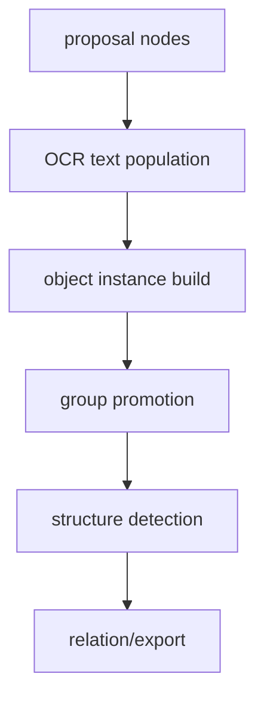

# 变更提案: object-instance-layer-refactor

## 元信息
```yaml
类型: 重构/修复
方案类型: implementation
优先级: P0
状态: 进行中
创建: 2026-03-11
```

---

## 1. 需求

### 背景
第五、六轮已经分别补上了普通 connector relation 和文字剥离预处理，但主样本 `picture/a22efeb2-370f-4745-b79c-474a00f105f4.png` 仍存在主体图形识别错误。根因已经收敛为：当前主链仍以连通域/轮廓为核心，只在后面追加 `group` 与 `relation`，缺少稳定的对象层。

这会直接导致：

- 顶部标题文本容易被错误吸附到巨大的背景区域
- 右侧 `Omnigenic` 大外轮廓会被误当成普通 `labeled_region box`
- 中部彩色团块、右侧网络容器、文字框和连接骨架没有显式对象身份
- connector relation 只能锚定到最近邻 region/text，而不是更稳定的对象边界

### 目标
- 为 scene graph 新增最小对象层，显式表达 `title / label_box / network_container / cluster_region`
- 阻止大容器区域继续被错误识别为普通 box
- 让后续关系层和导出层能消费对象元数据，而不是只消费低层 node/group
- 用主样本回归验证对象层已能覆盖右侧大容器和顶部标题等关键失败点

### 约束条件
```yaml
时间约束: 本轮优先做最小对象层，不同时引入外部检测模型
性能约束: 不新增重量级依赖或训练流程，保持当前 pipeline 可本地回归
兼容性约束: 现有 SceneGroup / SceneRelation 链路继续保留，对 export_svg 采用增量接入
业务约束: 继续以主样本视觉还原为最高优先级；修改期间建议关闭 plot2svg-app
```

### 验收标准
- [ ] `SceneGraph` 可序列化对象层数据，至少支持 `title`、`label_box`、`network_container`、`cluster_region`
- [ ] `promote_component_groups(...)` 不再把明显的大容器区域错误吸附成普通 `labeled_region`
- [ ] `detect_structures(...)` 可利用对象层避免将大型网络容器误标为 box
- [ ] 主样本 scene graph 中出现对象层元数据，且右侧大容器不再仅以普通 box 语义存在
- [ ] `pytest -q` 保持全绿

---

## 2. 方案

### 技术方案
采用“对象实例优先”的最小对象层方案，而不是继续阈值微调。

第一步，在 `scene_graph.py` 中新增对象层数据模型，并在 OCR 之后、group 提升之前构建对象实例。  
第二步，优先识别三类高价值对象：顶部标题文本、带文字的标签框、大型网络/团块容器。  
第三步，让 `promote_component_groups(...)` 和 `detect_structures(...)` 消费对象元数据，阻止标题误吸附到大容器、阻止大容器误标为普通 box。  
第四步，在 `export_svg.py` 中输出对象层元数据，便于主样本回归检查对象边界是否已建立。  
第五步，用单元测试和主样本 pipeline 回归把对象层行为锁定。

### 影响范围
```yaml
涉及模块:
  - scene_graph: 新增对象层数据模型与最小对象构建
  - detect_structure: 结合对象层收敛 box / container 误判
  - export_svg: 输出对象层元数据
  - pipeline: 在 scene graph 主链中接入对象层
  - tests/test_scene_graph.py: 对象层构建回归
  - tests/test_detect_structure.py: 大容器不误标 box 回归
  - tests/test_pipeline.py: 主样本对象层回归
预计变更文件: 7-10
```

### 风险评估
| 风险 | 等级 | 应对 |
|------|------|------|
| 对象层规则过粗，仍把普通 region 误识别为大容器 | 中 | 先限定在标题/标签框/大网络容器这几类高价值对象，避免一次铺太开 |
| 对象层引入后与现有 group/relation 语义冲突 | 中 | 保持 group/relation 兼容，先用对象层做“约束和元数据”，不直接替换旧链路 |
| 导出层只增加元数据而视觉提升有限 | 中 | 本轮重点先修对象边界和误判；若对象层稳定，再进入下一轮对象驱动导出 |

---

## 3. 技术设计

### 架构设计


### 数据模型
| 字段 | 类型 | 说明 |
|------|------|------|
| id | str | 对象唯一标识 |
| object_type | str | `title` / `label_box` / `network_container` / `cluster_region` |
| bbox | list[int] | 对象边界 |
| node_ids | list[str] | 归属节点 |
| group_ids | list[str] | 归属 group |
| metadata | dict[str, object] | 扩展字段，如 `title_text`、`panel_hint`、`box_like` |

---

## 4. 核心场景

### 场景: 顶部标题不再误吸附到大容器
**模块**: `scene_graph`
**条件**: 文本节点位于顶部分区，附近存在超大 region
**行为**: 文本优先识别为 `title` 对象，而不是被 `_find_anchor_region(...)` 吸成普通 label box
**结果**: 顶部 `Polygenic / Stratagenic / Omnigenic` 标题保留为独立对象

### 场景: 右侧 Omnigenic 大外轮廓被识别为网络容器
**模块**: `scene_graph` / `detect_structure`
**条件**: 大型 region 内含多个子节点或连接骨架
**行为**: 识别为 `network_container` 对象，并避免后续继续落入普通 `box` 分类
**结果**: 主样本右侧主体结构拥有显式对象身份，而不是仅作为一个误判 box 存在

---

## 5. 技术决策

### object-instance-layer-refactor#D001: 先做最小对象层，而不是直接引入检测模型
**日期**: 2026-03-11
**状态**: ✅采纳
**背景**: PDF 分析和主样本回归都表明，当前失败根因是缺少对象层；但直接引入 `SAM/YOLO` 会显著扩大依赖、环境和调试范围。
**选项分析**:
| 选项 | 优点 | 缺点 |
|------|------|------|
| A: 最小对象层 | 改动聚焦，可立即约束现有误判 | 仍以启发式为主，短期不是最终形态 |
| B: 直接引入模型 | 长期上限更高 | 依赖更重，验证周期更长 |
**决策**: 选择方案 A
**理由**: 当前更需要先让 pipeline 从“纯轮廓补丁”迈到“对象层约束”，而不是立即切到高成本模型路线。
**影响**: `scene_graph`, `detect_structure`, `export_svg`, `pipeline`, `tests`
