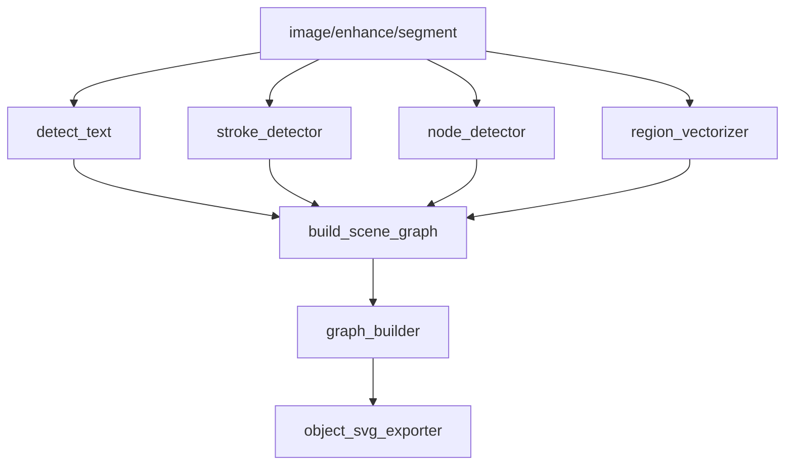

# 变更提案: object-driven-vector-reconstruction

## 元信息
```yaml
类型: 重构/修复
方案类型: implementation
优先级: P0
状态: 已确认
创建: 2026-03-11
```

---

## 1. 需求

### 背景
第七轮已经补上最小 `SceneObject` 层，解决了标题文本被大容器吞掉、网络容器被误判为普通 box 的问题，但主样本 `picture/a22efeb2-370f-4745-b79c-474a00f105f4.png` 的导出结果仍然存在明显结构失真。根因已经确认不在阈值或“训练不足”，而在于当前矢量重建仍然是 `bbox 裁切 -> contour/path` 驱动，无法正确表达科学图中的节点、边、容器、文本和图标等对象级结构。

### 目标
- 将当前 contour-driven 的矢量重建链升级为 object-driven 的最小可用主链
- 让 connector / edge 以 polyline/path 形式稳定导出，而不是被当成填充碎片
- 重建 `Node ↔ Edge ↔ Node` 拓扑关系，使 scene graph 能表达显式图结构
- 让大型容器区域以单个 region + holes 的形式导出，而不是被切成大量碎片
- 保证 OCR 结果稳定走 `SceneObject(TEXT) -> SVG <text>` 链路
- 保持第七轮 `SceneObject` 架构，不回退到纯 contour 管线

### 约束条件
```yaml
时间约束: 本轮需完成完整可运行重构，不停留在分析或半成品模块
性能约束: 继续使用现有 OpenCV + NumPy + Pillow 技术栈，不引入重型训练模型
兼容性约束: 需兼容现有 pipeline、测试框架和第七轮 SceneObject / SceneRelation 数据
业务约束: 主样本优先，修改期间避免依赖前端缓存结果，建议关闭 plot2svg-app
```

### 验收标准
- [ ] 主样本中的 connector / edge 以干净 path/polyline 导出，不再主要依赖 contour 填充碎片
- [ ] scene graph 中可显式表达 node、edge、region、text 的对象级结构
- [ ] 大型容器区域可导出为单一 region 及 holes，而不是碎片化多 polygon
- [ ] OCR 识别文本在最终 SVG 中稳定输出为 `<text>`
- [ ] 新增并通过 stroke vectorization、graph reconstruction、arrow detection 相关测试
- [ ] 保持现有测试兼容，并完成全量回归验证

---

## 2. 方案

### 技术方案
采用“对象驱动主链重建”方案，新增最小 primitive / graph 层并逐步替换旧 `vectorize_region / vectorize_stroke` 的 contour 主逻辑：

- 新增 `stroke_detector.py`
  - 负责 stroke/connector 检测、骨架化或细线追踪、polyline 生成、箭头头部检测
- 新增 `node_detector.py`
  - 负责基于圆检测与圆度过滤提取 node primitive
- 新增 `region_vectorizer.py`
  - 负责基于 mask 的区域矢量化与 hole-aware 路径输出
- 新增 `graph_builder.py`
  - 负责 edge 端点锚定到 node，重建 `GraphEdge`
- 扩展 `SceneGraph`
  - 在保留 `nodes / groups / relations / objects` 的同时，引入最小可用的 object-driven primitives 表达
- 调整 `pipeline.py`
  - 在 segment/OCR 之后新增对象级检测与 graph build 流程
- 改造 `export_svg.py`
  - 导出顺序切换为 `regions -> edges -> nodes -> text`
  - exporter 优先消费对象层和 graph 层，而不是直接消费 contour 结果
- 保留兼容层
  - 旧 `vectorize_region / vectorize_stroke` 不立即删除，先转为对新模块的适配入口，保证现有测试与调用面可平滑迁移

### 影响范围
```yaml
涉及模块:
  - pipeline: 从 contour 驱动切换到对象驱动主链
  - scene_graph: 扩展对象/primitive/graph 数据承载能力
  - detect_structure: 从 group/relation 兼容识别过渡到对象层辅助识别
  - export_svg: 改为对象驱动导出顺序与导出策略
  - vectorize_region: 退化为 region object/vector adapter
  - vectorize_stroke: 退化为 stroke object/vector adapter
  - 新增 stroke_detector / node_detector / region_vectorizer / graph_builder: 承担 Round 8 核心能力
预计变更文件: 10-14
```

### 风险评估
| 风险 | 等级 | 应对 |
|------|------|------|
| 旧 contour 逻辑与新对象层并存期间出现双轨不一致 | 高 | 保留兼容适配层，但让 pipeline 和 exporter 只认一条主链 |
| 图结构锚定启发式不稳导致误连边 | 高 | 先补最小规则与回归测试，再用主样本调试 |
| 大容器区域重建时误吞内部节点 | 中 | region 输出只负责 outer/holes，节点单独作为 node object 导出 |
| 导出顺序变化导致旧 SVG 断言失效 | 中 | 同步更新测试，用对象级断言替代 contour 细节断言 |

---

## 3. 技术设计（可选）

> 涉及架构变更、API设计、数据模型变更时填写

### 架构设计


### API设计
#### `detect_strokes(image, scene_graph, coordinate_scale=1.0)`
- **输入**: 图像、当前 `SceneGraph`、坐标缩放
- **输出**: `StrokePrimitive[]`

#### `detect_nodes(image, scene_graph, coordinate_scale=1.0)`
- **输入**: 图像、当前 `SceneGraph`、坐标缩放
- **输出**: `NodeObject[]`

#### `vectorize_region_objects(image, scene_graph, coordinate_scale=1.0)`
- **输入**: 图像、当前 `SceneGraph`、坐标缩放
- **输出**: `RegionObject[]`

#### `build_graph(scene_graph, stroke_primitives, node_objects)`
- **输入**: `SceneGraph`、stroke primitives、node objects
- **输出**: 更新后的 `SceneGraph`

### 数据模型
| 字段 | 类型 | 说明 |
|------|------|------|
| `StrokePrimitive.points` | `list[list[float]]` | connector/edge 的 polyline 点集 |
| `StrokePrimitive.width` | `float` | 估计线宽 |
| `StrokePrimitive.arrow_head` | `dict | None` | 箭头头部几何信息 |
| `NodeObject.center` | `list[float]` | 节点中心 |
| `NodeObject.radius` | `float` | 节点半径 |
| `RegionObject.outer_path` | `str` | 外轮廓路径 |
| `RegionObject.holes` | `list[str]` | 孔洞路径集合 |
| `GraphEdge.source_node` | `str` | 源节点 ID |
| `GraphEdge.target_node` | `str` | 目标节点 ID |
| `GraphEdge.path` | `list[list[float]]` | 边路径点集 |

---

## 4. 核心场景

> 执行完成后同步到对应模块文档

### 场景: 主样本中的连接线重建
**模块**: `stroke_detector` / `graph_builder` / `export_svg`
**条件**: 输入图中存在 connector、arrow、network edge
**行为**: 先检测 stroke primitive，再锚定端点，最后按 edge 导出 path
**结果**: 连接线不再被输出为碎片 contour，而是稳定 polyline/path

### 场景: 主样本中的大型容器导出
**模块**: `region_vectorizer` / `export_svg`
**条件**: 输入图中存在包含内部空洞和装饰的大区域
**行为**: 用 mask-based、hole-aware 方式生成单 region object
**结果**: 大容器保持为单一外轮廓 + holes，而不是大量分裂 polygon

### 场景: OCR 文本导出
**模块**: `ocr` / `scene_graph` / `export_svg`
**条件**: OCR 已识别出文本内容与 bbox
**行为**: 将文本写入对象层并在最终 SVG 中输出 `<text>`
**结果**: 文本不再混入 contour 图元，保持可编辑文字元素

---

## 5. 技术决策

> 本方案涉及的技术决策，归档后成为决策的唯一完整记录

### object-driven-vector-reconstruction#D001: 采用对象驱动主链重建而非继续修补 contour 导出
**日期**: 2026-03-11
**状态**: ✅采纳
**背景**: 第七轮后主样本仍明显失真，说明继续在 contour 导出层打补丁无法解决结构保真问题
**选项分析**:
| 选项 | 优点 | 缺点 |
|------|------|------|
| A: 渐进式桥接改造 | 风险较低，兼容现有调用面 | 双轨逻辑重，根因修复不彻底 |
| B: 导出层优先改造 | 见效快，修改集中 | 仍然依赖 contour 主链，只是后处理补丁 |
| C: 对象驱动主链重建 | 正面修复根因，后续可持续扩展 | 改动面最大，需要同步调整数据结构与测试 |
**决策**: 选择方案C
**理由**: 当前问题已经被证明确认为“主链错误”而非“参数不足”，必须把 exporter 的输入从 contour 结果升级到 object/graph 结果
**影响**: 影响 `pipeline.py`、`scene_graph.py`、`detect_structure.py`、`export_svg.py` 以及新增的 primitive / graph 模块
