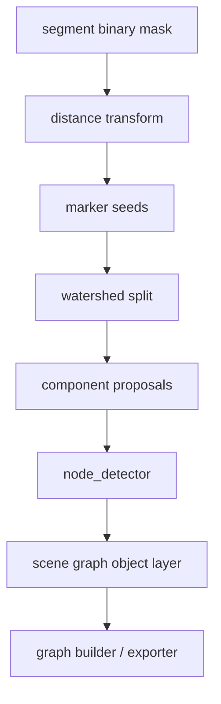

# 变更提案: instance-aware-polygon-repair

## 元信息
```yaml
类型: 修复/优化
方案类型: implementation
优先级: P0
状态: 已确认
创建: 2026-03-11
```

---

## 1. 需求

### 背景
第八轮已经把主链从 contour-driven 升级为 object-driven，但主样本和 `./picture` 中的复杂图仍然存在显著误识别。当前最突出的失败模式不是导出顺序，而是上游组件提案质量不足：粘连节点没有被拆开、三角形和五边形等几何节点没有被提升为显式 `NodeObject`、合并逻辑会把相邻但本应独立的对象提前吞并，最终导致 graph builder 和 SVG exporter 拿到的对象层输入已经失真。

### 目标
- 在 `segment.py` 中引入实例级拆分能力，优先解决相连节点和粘连区域无法切开的问题
- 在 `node_detector.py` 中把 triangle / pentagon 等多边形节点提升为一等节点对象，而不是只识别 circle-like region
- 收紧 `segment.py` 的自动合并策略，避免带有明确几何特征的相邻对象被误合并
- 以 `./picture/a22efeb2-370f-4745-b79c-474a00f105f4.png` 和同目录样本做回归验证，确保这轮改动直接改善识别质量
- 保持 Round 8 object-driven pipeline、SceneGraph primitives 和导出兼容层不被破坏

### 约束条件
```yaml
时间约束: 本轮需完成完整修复、样本验证和知识库同步，不停留在分析
性能约束: 继续使用现有 OpenCV/NumPy 栈，不引入额外训练模型或重型依赖
兼容性约束: 需兼容现有 pipeline、测试框架、Round 8 的 object-driven 主链和 legacy adapter
业务约束: 主样本优先，测试期间避免使用前端旧缓存结果，修改和批量验证时应关闭 plot2svg-app
```

### 验收标准
- [ ] 粘连图形在 `segment.py` 中可通过实例拆分拆成独立 proposal，不再大面积并为单个 region
- [ ] `node_detector.py` 可识别 circle、triangle、pentagon 三类显式节点，并写入对象元数据
- [ ] 合并门控不再对带明确几何特征的 proposal 使用激进合并，误吞并回归测试通过
- [ ] `./picture` 主样本与至少一个附加样本回归执行成功，识别结果较当前版本更稳定
- [ ] 相关单元测试和全量 `pytest` 回归通过

---

## 2. 方案

### 技术方案
采用“实例拆分优先”的修复路径，在保持 Round 8 主链不变的前提下增强对象层输入质量：

- `segment.py`
  - 在 region/stroke 提案前加入距离变换与 marker 生成逻辑
  - 对大面积、低细长度、疑似多中心粘连区域执行 watershed 拆分
  - 将拆分后的 proposal 保留各自的 mask、bbox、shape_hint，避免在压缩阶段再次被过早合并
  - 调整 `_find_merge_target` / `_find_record_merge_target`，对高置信几何对象采用更严格门控
- `node_detector.py`
  - 在现有 Hough circle + circularity fallback 之外，增加 contour polygon approximation
  - 对近似轮廓使用 `cv2.approxPolyDP(...)` 识别 3 边形和 5 边形
  - 将节点输出从“只有 radius 的圆节点”扩展为“带 shape/type/size 元数据的节点对象”
- `scene_graph.py` / 下游兼容
  - 维持现有 `NodeObject` 结构可用，通过 metadata 承载 `shape_type`、`vertex_count`、`size`
  - 保证 network container / cluster region 等启发式既能识别圆，也能识别新多边形节点
- 测试与样本验证
  - 先补针对实例拆分、多边形节点识别、误合并回归的失败测试
  - 再用 `./picture` 样本验证 pipeline 结果，必要时补最小回归断言

### 影响范围
```yaml
涉及模块:
  - segment: 增加实例级分割与更保守的 proposal 合并逻辑
  - node_detector: 增加 polygon node detection 与节点元数据扩展
  - scene_graph: 兼容 polygon node metadata，并让对象层启发式利用新 shape 信息
  - pipeline: 继承更细粒度 proposal，样本验证时观察输出稳定性
  - tests/test_segment.py: 覆盖实例拆分与误合并回归
  - tests/test_scene_graph.py: 覆盖对象层对多边形节点的兼容
  - tests/test_pipeline.py 或新增测试: 覆盖主样本级回归断言
预计变更文件: 6-9
```

### 风险评估
| 风险 | 等级 | 应对 |
|------|------|------|
| watershed 过分切分，导致单个大容器被错误拆碎 | 高 | 只对满足“大区域 + 多中心 + 非细线”的候选执行拆分，并补反例测试 |
| polygon detection 误把不规则图标当作节点 | 中 | 用面积、凸性、顶点数、边长一致性和 bbox 尺寸共同过滤 |
| 收紧合并阈值后 proposal 数量激增，影响下游规则 | 中 | 把门控限定在带 shape_hint 或显式 node 候选上，保留普通碎片压缩 |
| 样本回归断言过强导致后续维护困难 | 低 | 以对象数量、shape metadata、误合并消失等结构性断言为主，不锁死像素级输出 |

---

## 3. 技术设计（可选）

### 架构设计


### API设计
#### `segment._split_component_mask(mask)`
- **输入**: 单个候选区域的二值 mask
- **输出**: 一个或多个拆分后的局部 mask

#### `node_detector._classify_polygon_node(contour, bbox)`
- **输入**: contour、原始 bbox
- **输出**: `{shape_type, center, size, vertex_count}` 或 `None`

### 数据模型
| 字段 | 类型 | 说明 |
|------|------|------|
| `ComponentProposal.shape_hint` | `str | None` | proposal 的几何提示，如 `circle` / `triangle` / `pentagon` |
| `NodeObject.metadata.shape_type` | `str` | 节点几何类型 |
| `NodeObject.metadata.vertex_count` | `int | None` | 多边形顶点数 |
| `NodeObject.metadata.size` | `dict` | 节点外接尺寸信息 |

---

## 4. 核心场景

### 场景: 粘连节点拆分
**模块**: `segment`
**条件**: 一个 region mask 内存在多个局部中心，且外轮廓连成单个 blob
**行为**: 对该 mask 执行距离变换、marker 提取和 watershed 拆分
**结果**: 输出多个独立 component proposal，供下游对象层分别识别

### 场景: 三角形/五边形节点识别
**模块**: `node_detector`
**条件**: region crop 内存在规则 polygon 轮廓
**行为**: 使用 `approxPolyDP` 做轮廓拟合，并按顶点数分类
**结果**: 输出显式 `NodeObject`，metadata 中包含形状类型和顶点信息

### 场景: 显式几何对象的误合并保护
**模块**: `segment`
**条件**: 两个 proposal 之间有较高 overlap，但至少一方已具备明确形状提示或实例拆分来源
**行为**: 采用更严格 overlap / containment 条件，默认不合并
**结果**: 多个独立对象保留到 scene graph，而不是在 proposal 压缩阶段丢失

---

## 5. 技术决策

### instance-aware-polygon-repair#D001: 采用实例级拆分修复粘连对象，而不是继续下游补救
**日期**: 2026-03-11
**状态**: ✅采纳
**背景**: 当前误识别的根因主要发生在 proposal 阶段，下游 graph/exporter 只能消费已经失真的对象层输入
**选项分析**:
| 选项 | 优点 | 缺点 |
|------|------|------|
| A: 继续调 scene graph / exporter 阈值 | 改动集中 | 只能事后补救，无法恢复已丢失的实例边界 |
| B: 在 segment 引入实例级拆分 | 直接修复根因，能提升整个对象链质量 | 需要新增测试并谨慎控制过分切分 |
| C: 引入外部实例分割模型 | 理论上更强 | 成本高，不符合当前技术栈约束 |
**决策**: 选择方案B
**理由**: 现有问题首先是 proposal 粘连，而不是 exporter 不会画；先把对象切对，下游启发式才有意义
**影响**: 影响 `segment.py`、相关测试和主样本输出质量

### instance-aware-polygon-repair#D002: 在 node object metadata 中扩展多边形语义，而不重做 NodeObject 结构
**日期**: 2026-03-11
**状态**: ✅采纳
**背景**: 需要支持 triangle / pentagon，但又不想破坏 Round 8 已接入的 `NodeObject(center, radius, metadata)` 链路
**选项分析**:
| 选项 | 优点 | 缺点 |
|------|------|------|
| A: 直接重构 NodeObject 数据结构 | 表达更完整 | 影响范围扩大，需同步修改 exporter / graph builder / tests |
| B: 保持结构不变，在 metadata 中补充 `shape_type` 等字段 | 改动面小，兼容性最好 | 圆和多边形统一抽象较弱 |
| C: 完全不提升为 NodeObject，只保留 region shape_hint | 改动最小 | 仍无法让 graph 层把 polygon 当一等节点 |
**决策**: 选择方案B
**理由**: 当前目标是先修复识别质量，不做不必要的数据结构重构
**影响**: 影响 `node_detector.py`、`scene_graph.py` 与对象级回归断言
