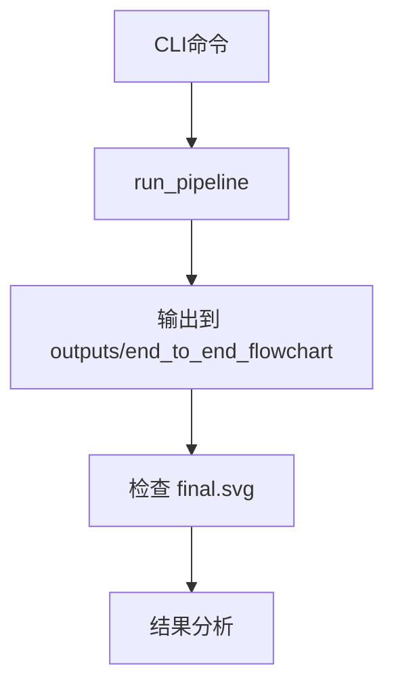

# 变更提案: run-end-to-end-flowchart

## 元信息
```yaml
类型: 优化
方案类型: implementation
优先级: P1
状态: 已确认
创建: 2026-03-15
```

---

## 1. 需求

### 背景
用户要求对 `picture/end_to_end_flowchart.png` 进行一次基线“训练”，结合仓库现状可落地的含义是运行现有 `plot2svg` 管线，将该图片转换为 SVG，并基于输出结果给出简要质量分析。本次不涉及源码修改，也不进入参数调优或模型训练。

### 目标
- 使用现有 CLI 对目标图片执行一次基线转换
- 将输出稳定落盘到 `outputs/end_to_end_flowchart/`
- 以成功生成 `final.svg` 为完成标准
- 对生成质量给出简要问题结论，便于后续是否进入定向优化

### 约束条件
```yaml
时间约束: 单轮执行，本次会话内完成
性能约束: 优先使用现有 balanced + auto 基线配置，不做额外性能优化
兼容性约束: 不修改现有源码和依赖环境
业务约束: 仅运行现有管线并分析结果，不扩展为训练集构建或代码修复
```

### 验收标准
- [ ] `outputs/end_to_end_flowchart/final.svg` 成功生成
- [ ] 输出目录包含至少 `final.svg` 与 `scene_graph.json`
- [ ] 形成针对本次输出质量的简要结论，不改源码

---

## 2. 方案

### 技术方案
使用现有命令入口 `python -X utf8 -m plot2svg.cli` 执行单图基线转换，输入文件为 `picture/end_to_end_flowchart.png`，输出目录为 `outputs/end_to_end_flowchart/`，配置固定为 `--profile balanced --enhancement-mode auto`。执行完成后检查 CLI 输出、产物文件是否存在，并结合 `final.svg` 与 `scene_graph.json` 做简要结果判断。

### 影响范围
```yaml
涉及模块:
  - cli.py: 仅作为现有运行入口，不修改
  - pipeline.py: 仅通过现有编排执行，不修改
  - outputs/end_to_end_flowchart/: 新增本次运行产物
预计变更文件: 0（源码）
```

### 风险评估
| 风险 | 等级 | 应对 |
|------|------|------|
| 目标图片复杂度较高，基线结果可能存在结构误判或文字识别缺陷 | 中 | 保留完整输出目录并在结论中明确问题类型 |
| 运行时依赖或环境差异导致 CLI 失败 | 低 | 先确认模块可导入和 CLI 可启动，再执行正式运行 |
| 仓库存在 README 合并冲突等现状问题 | 低 | 本次不触碰源码，仅做只读执行与结果分析 |

---

## 3. 技术设计（可选）

> 涉及架构变更、API设计、数据模型变更时填写

### 架构设计


### API设计
本次无新增 API。

### 数据模型
本次无新增数据模型。

---

## 4. 核心场景

> 执行完成后同步到对应模块文档

### 场景: 单图基线转换验证
**模块**: CLI / pipeline
**条件**: `picture/end_to_end_flowchart.png` 存在，运行环境可导入 `plot2svg` 及其依赖
**行为**: 运行现有 CLI，将结果写入 `outputs/end_to_end_flowchart/`
**结果**: 生成 `final.svg` 并输出简要质量分析

---

## 5. 技术决策

> 本方案涉及的技术决策，归档后成为决策的唯一完整记录

### run-end-to-end-flowchart#D001: 首轮采用 balanced 基线运行
**日期**: 2026-03-15
**状态**: ✅采纳
**背景**: 用户要求先运行现有管线并生成结果分析。首轮需要选择最能代表当前仓库默认能力的执行配置。
**选项分析**:
| 选项 | 优点 | 缺点 |
|------|------|------|
| A: balanced + auto | 贴近默认使用方式，适合作为当前主线能力基线 | 对极难样本不一定最优 |
| B: quality + auto | 可能保留更多细节 | 更慢，也更可能引入噪声，不适合作为首轮客观基线 |
| C: balanced + sr_x2 | 对低清样本可能有帮助 | 超分会引入额外变量，影响基线判断 |
**决策**: 选择方案 A
**理由**: 当前目标是先得到可复查的基线结果，而不是追求最优视觉效果。`balanced + auto` 与仓库默认预期一致，更适合后续对比和问题归因。
**影响**: 仅影响本次输出目录中的运行结果，不影响源码和默认配置
