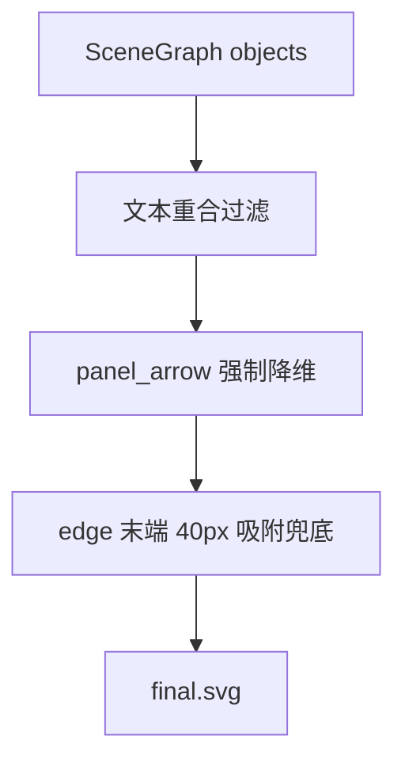

# 变更提案: round25-force-override

## 元信息
```yaml
类型: 修复
方案类型: implementation
优先级: P0
状态: 已确认
创建: 2026-03-17
```

---

## 1. 需求

### 背景
`end_to_end_flowchart` 在上一轮回归中重新出现两类结构性问题：其一，文本附近的候选 region/stroke 被错误输出为纯黑或深色实心块，遮挡内容；其二，跨面板箭头和 connector 的语义化接管不彻底，仍存在 polygon 箭头和悬空末端。

### 目标
1. 在最终导出前强制过滤与 `text` 高重合的错误 region/stroke，避免文本周围黑块进入 `final.svg`。
2. 将 `shape_hint == 'panel_arrow'` 的跨面板箭头强制降维为粗线/路径并统一挂载标准 `marker`，禁止继续输出实心 polygon 箭头。
3. 在 SVG 渲染前对 connector 末端做最后一次 40px 半径吸附兜底，强制将末端坐标对齐到最近的 `text/template` 锚点边界。

### 约束条件
```yaml
时间约束: 本轮优先止血，放弃温和修复
性能约束: 不引入全图级高成本搜索，兜底吸附限定在导出前的局部半径搜索
兼容性约束: 保持现有 standard-arrow defs 与 edge 导出格式兼容
业务约束: 强制拦截优先级高于局部视觉拟合，宁可留白也不输出脏黑块
```

### 验收标准
- [ ] `final.svg` 中不再出现与文本框高重合的黑色/深色 region 遮挡块。
- [ ] `panel_arrow` 不再以 `<polygon>` 输出，而是统一为带 `marker-end` 的粗线/路径。
- [ ] 悬空 connector 在导出前被末端兜底吸附，`final.svg` 中不再出现明显游离的 arrow end。

---

## 2. 方案

### 技术方案
采用“导出层强制接管”为主的 override 方案：
- 在对象导出前增加基于文本 BBox 的高重合过滤，直接丢弃疑似文本底噪 region/stroke。
- 在箭头导出路径中，发现 `panel_arrow` 后不走 region polygon，而转换为粗 `line/polyline/path` 并统一挂载 `standard-arrow` marker。
- 在 edge 最终渲染前执行一次半径 40px 的邻域锚点搜索，如果存在最近 `text/svg_template` 锚点，则强制改写末端坐标为边界点。

### 影响范围
```yaml
涉及模块:
  - graph_builder.py: 保留已有拓扑重建，但补充/复用文本锚点与末端坐标修正辅助逻辑
  - object_svg_exporter.py: 增加文本重合过滤、panel_arrow 降维替换、edge 末端兜底吸附
  - export_svg.py: 复用现有 standard-arrow defs，无需新增命名空间变更
  - tests/test_graph_builder.py: 增加末端吸附与高重合过滤相关测试
  - tests/test_export_svg.py: 增加 panel_arrow 降维与 edge override 回归测试
预计变更文件: 4-5
```

### 风险评估
| 风险 | 等级 | 应对 |
|------|------|------|
| 文本重合过滤过严，误删合法小图元 | 中 | 采用 IoU + 包围比例双条件，只对高重合候选生效 |
| panel_arrow 全部降维后视觉粗细不稳 | 中 | 直接从 bbox 计算 stroke-width，限制上下界 |
| edge 末端兜底误吸到错误文本 | 中 | 限制在 40px 半径，并优先边界 gap 最小的 `text/svg_template` 锚点 |

---

## 3. 技术设计（可选）

### 架构设计


---

## 4. 核心场景

### 场景: 文本旁误检黑块拦截
**模块**: object_svg_exporter
**条件**: region/stroke 的 bbox 与任意 text bbox 高重合
**行为**: 导出前直接丢弃该对象
**结果**: 文本周围不再出现黑色遮挡块

### 场景: 跨面板箭头强制替换
**模块**: object_svg_exporter
**条件**: node 或 region object 标记为 `panel_arrow`
**行为**: 禁止输出 polygon，改为粗路径 + marker-end
**结果**: 箭头边缘锐利且可编辑

### 场景: connector 悬空末端兜底
**模块**: object_svg_exporter / graph_builder
**条件**: edge 末端 40px 半径内存在 text/template 锚点
**行为**: 将最后一个点强制吸附到最近锚点边界
**结果**: edge end 不再游离

---

## 5. 技术决策

### round25-force-override#D001: 以导出层 override 接管回归修复
**日期**: 2026-03-17
**状态**: ✅采纳
**背景**: 当前回归的主要症状都出现在 `final.svg` 的最后一公里，继续在早期 CV 阶段做温和修正，难以快速止血。
**选项分析**:
| 选项 | 优点 | 缺点 |
|------|------|------|
| A: 导出层强制接管 | 修改集中、止血快、便于直接约束 final.svg 行为 | 规则更硬，可能牺牲少量局部细节 |
| B: 回到 scene graph 前置清洗 | 理论上更干净 | 影响链路更长，回归面更大，验证成本更高 |
**决策**: 选择方案 A
**理由**: 本轮目标是强制拦截与拓扑接管，导出层是最稳定、最可验证的拦截点，可以最小代价覆盖文本黑块、panel_arrow 和 connector 末端三个问题。
**影响**: 主要影响 `object_svg_exporter.py`，并轻触 `graph_builder.py` 的锚点辅助逻辑。
