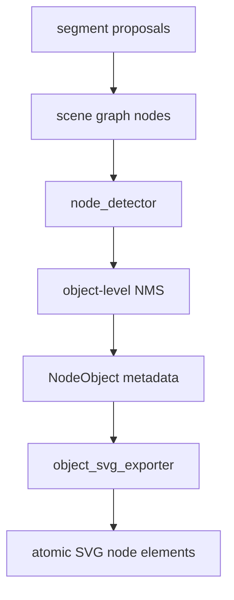

# 变更提案: node-object-nms-atomic-export

## 元信息
```yaml
类型: 修复/优化
方案类型: implementation
优先级: P0
状态: 已确认
创建: 2026-03-12
```

---

## 1. 需求

### 背景
当前图片转 SVG 仍存在明显的对象识别错误。对主样例 `picture/a22efeb2-370f-4745-b79c-474a00f105f4.png` 的诊断显示：
- `node_objects=46`，其中 `25` 个来自 `region-hough-*`，说明圆形补检过于激进，存在明显重复或误检风险。
- `shape_hint` 中仍存在 `triangle`，但最终 `node_objects` 里 `triangle=0`，说明三角形在节点提升阶段被丢失。
- 已被识别成 `pentagon` 的节点在最终 SVG 中仍被导出为 `<circle class='node'>`，说明导出层把多边形重新圆形化。

### 目标
- 在对象层引入保守 NMS，压制高度重叠或异常接近的重复节点，优先处理 `Hough` 圆补检带来的噪声。
- 为三角形补充方向性特征，避免实例被错误合并，并为后续实例分离提供稳定信号。
- 让 `NodeObject` 以原子方式导出，按真实几何类型输出独立 SVG 元素，不再把多边形节点统一画成圆。
- 使用 `./picture` 中样例进行回归验证，确保主样例节点输出更接近原图结构，且不破坏现有场景图/边/区域能力。

### 约束条件
```yaml
时间约束: 当前轮次内完成完整修复与验证
性能约束: 保持现有 OpenCV/NumPy 栈，不引入重型外部模型
兼容性约束: 保持现有 pipeline / scene_graph / export_svg 对外接口可用
业务约束: 优先保障图形识别保真度，不回退已有 Round 9 的实例拆分与场景语义能力
```

### 验收标准
- [ ] 为对象层重复节点新增失败测试，并通过实现使其稳定通过。
- [ ] 为多边形节点导出新增失败测试，验证 `triangle` / `pentagon` 不再导出为 `<circle>`。
- [ ] 为三角形方向元数据新增失败测试，验证检测结果包含方向性信息。
- [ ] 主样例 `picture/a22efeb2-370f-4745-b79c-474a00f105f4.png` 运行后，`scene_graph.json` 与 `final.svg` 能体现去重后的节点集合与正确的多边形节点导出。

---

## 2. 方案

### 技术方案
采用对象层精准修复方案，分三步执行：
1. 在 `node_detector.py` 后引入对象级 NMS，对同形状、同中心附近、显著重叠的节点进行抑制，尤其压制 `region-hough-*` 注入带来的重复圆节点。
2. 在节点检测阶段为三角形补充朝向 metadata，并把该信息保留到 `NodeObject`，后续去重时把朝向一致性作为保守约束。
3. 在 `object_svg_exporter.py` 中按 `shape_type` 分支导出 `circle` / `triangle` / `pentagon`，保持一对象一元素的原子化导出，不合并多个节点 path。

### 影响范围
```yaml
涉及模块:
  - src/plot2svg/node_detector.py: 节点识别、朝向 metadata、对象级 NMS
  - src/plot2svg/object_svg_exporter.py: 节点几何导出与原子导出约束
  - tests/test_node_detector.py: 节点识别与朝向回归测试
  - tests/test_export_svg.py: 多边形节点导出回归测试
  - tests/test_pipeline.py: 真实样例或对象流回归测试
预计变更文件: 5
```

### 风险评估
| 风险 | 等级 | 应对 |
|------|------|------|
| NMS 过强，误删真实相邻节点 | 中 | 限制为同形状、显著重叠或违反近邻阈值时才压制，先用失败测试锁行为 |
| 三角形朝向不稳定 | 中 | 采用质心到主顶点的方向定义，并在低置信轮廓时降级为 `unknown` |
| 多边形导出影响现有节点样式 | 低 | 仅对 `shape_type in {triangle,pentagon}` 分支导出，其余保持圆形路径 |

---

## 3. 技术设计（可选）

> 本轮不改外部 API，补充内部对象元数据和导出分支。

### 架构设计


### 数据模型
| 字段 | 类型 | 说明 |
|------|------|------|
| `metadata.shape_type` | `str` | 节点几何类型，支持 `circle` / `triangle` / `pentagon` |
| `metadata.orientation` | `dict \| None` | 三角形朝向信息，包含角度与方向向量 |
| `metadata.suppressed_source_ids` | `list[str]` | NMS 被抑制的来源节点 id，便于调试 |

---

## 4. 核心场景

> 执行完成后同步到对应模块文档

### 场景: 主样例中的重复圆节点压制
**模块**: `node_detector.py`
**条件**: 场景图中同时存在轮廓节点与 `Hough` 注入节点，且同形状中心距离极近或重叠显著
**行为**: 对检测出的 `NodeObject` 执行对象级 NMS
**结果**: 保留更可信节点，抑制重复圆节点

### 场景: 多边形节点导出
**模块**: `object_svg_exporter.py`
**条件**: `NodeObject.metadata.shape_type` 为 `triangle` 或 `pentagon`
**行为**: 按真实几何顶点输出独立 SVG 元素
**结果**: 最终 SVG 中不再把多边形节点导出成 `<circle>`

### 场景: 三角形方向特征保留
**模块**: `node_detector.py`
**条件**: 轮廓被识别为三角形
**行为**: 计算朝向角与方向向量并写入 metadata
**结果**: 后续实例分离与调试可使用该信息

---

## 5. 技术决策

> 本方案涉及的技术决策，归档后成为决策的唯一完整记录

### node-object-nms-atomic-export#D001: 优先在对象层实施 NMS，而不是继续扩大上游分割改造
**日期**: 2026-03-12
**状态**: ✅采纳
**背景**: 主样例的主要噪声来自节点提升后的 `region-hough-*` 重复圆节点，而不是单纯的连通域未切开。
**选项分析**:
| 选项 | 优点 | 缺点 |
|------|------|------|
| A: 对象层 NMS | 改动集中，能直接抑制重复节点 | 不能单独解决所有上游误分割 |
| B: 继续扩大分割改造 | 从源头更干净 | 范围更大，无法解决导出层确定性 bug |
**决策**: 选择方案 A
**理由**: 当前证据显示问题主要集中在节点提升与节点导出之间，先修最短故障链路收益最高。
**影响**: `node_detector.py`、测试用例与样例验证流程

### node-object-nms-atomic-export#D002: 多边形节点按真实几何原子导出
**日期**: 2026-03-12
**状态**: ✅采纳
**背景**: 现有导出器把 `NodeObject` 一律渲染为圆，导致已识别多边形在最终 SVG 中失真。
**选项分析**:
| 选项 | 优点 | 缺点 |
|------|------|------|
| A: 统一仍导出圆 | 实现最简单 | 与识别结果冲突，保真度差 |
| B: 按 `shape_type` 导出独立几何 | 结果可编辑、几何一致 | 需要补顶点生成逻辑 |
**决策**: 选择方案 B
**理由**: 用户目标是提高保真度和后续可编辑性，原子导出是直接必要条件。
**影响**: `object_svg_exporter.py`、`tests/test_export_svg.py`
