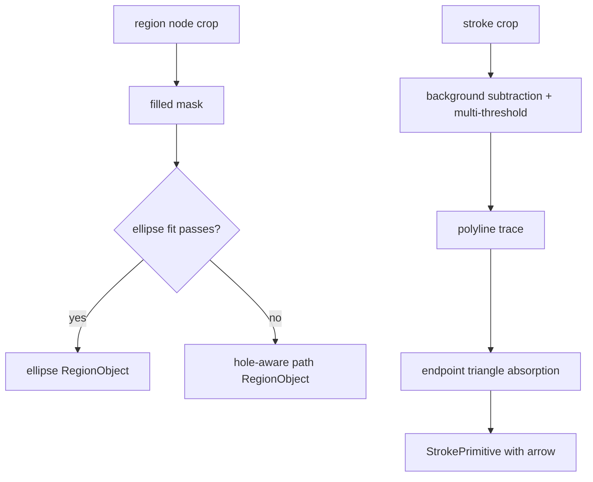

# 变更提案: ellipse-and-low-contrast-stroke-repair

## 元信息
```yaml
类型: 修复/优化
方案类型: implementation
优先级: P0
状态: 已确认
创建: 2026-03-12
```

---

## 1. 需求

### 背景
最新人工验收显示主样例在高密度科研图上仍存在严重结构坍塌：大型椭圆/圆形容器退化成碎多边形，半透明背景内部的细线和箭头大面积丢失，导致视觉结构断裂。现有 `region_vectorizer.py` 只做 contour path 追踪，`stroke_detector.py` 只做单次 Otsu 二值化，二者都缺少针对当前样例模式的保真逻辑。

### 目标
- 在 `region_vectorizer.py` 中为大型、近似椭圆的容器增加椭圆优先拟合，避免退化成碎多边形。
- 在 `stroke_detector.py` 中增强低对比、半透明背景下的细线检测，并提升箭头头部吸附稳定性。
- 用 `picture/a22efeb2-370f-4745-b79c-474a00f105f4.png` 和 `picture/F2.png` 做回归，输出新一版测试结果供人工验收。
- 保持现有对象驱动 pipeline 可运行，不破坏已通过的 node / graph / SVG 导出链路。

### 约束条件
```yaml
时间约束: 当前轮次内完成 P0 修复与验证
性能约束: 继续使用 OpenCV/NumPy，不引入外部模型
兼容性约束: 保持 RegionObject / StrokePrimitive / SceneGraph 接口兼容
业务约束: 优先修复视觉结构保真度，不在本轮主攻 star 识别和 segment 小圆点策略
```

### 验收标准
- [ ] 新增 `region_vectorizer.py` 的失败测试，验证近似椭圆的大区域优先输出椭圆而不是碎 path。
- [ ] 新增 `stroke_detector.py` 的失败测试，验证低对比细线和箭头连接在半透明背景下可被检测。
- [ ] 主样例 `a22...png` 重新导出后，椭圆容器与内部连线较当前结果明显恢复。
- [ ] `pytest -q` 全量通过。

---

## 2. 方案

### 技术方案
采用“双核心模块精准修复”方案：
1. `region_vectorizer.py` 增加 mask 质量评估、轮廓椭圆拟合、拟合误差门控，并在拟合失败时退化回现有 hole-aware path。
2. `stroke_detector.py` 增加局部背景减除与多策略二值化，优先保留低对比细线；对端点附近三角形轮廓做吸附，稳定生成带箭头的 `StrokePrimitive`。
3. 先写失败测试锁行为，再做实现，并用 `a22...png` / `F2.png` 跑真实样例回归。

### 影响范围
```yaml
涉及模块:
  - src/plot2svg/region_vectorizer.py: 椭圆优先拟合与退化策略
  - src/plot2svg/stroke_detector.py: 低对比线条检测与箭头吸附
  - tests/test_region_vectorizer.py: 新增区域对象层回归测试
  - tests/test_stroke_detector.py: 新增低对比与箭头吸附回归测试
  - tests/test_pipeline.py: 样例回归验证
预计变更文件: 5
```

### 风险评估
| 风险 | 等级 | 应对 |
|------|------|------|
| 椭圆拟合误判复杂多边形 | 中 | 增加面积、圆度、拟合误差联合门控，仅在高置信区域启用 |
| 背景减除过强导致噪声进线条 | 中 | 使用双阈值策略并保留最小长度/连通性约束 |
| 箭头吸附把装饰三角形误并到线段 | 中 | 仅在端点邻域内且方向一致时合并 |

---

## 3. 技术设计（可选）

> 本轮不改对外 API，只增强内部保真逻辑。

### 架构设计


### 数据模型
| 字段 | 类型 | 说明 |
|------|------|------|
| `RegionObject.metadata.shape_type` | `str` | 区域对象几何类型，新增 `ellipse` |
| `RegionObject.metadata.fit_error` | `float` | 椭圆拟合误差，便于调试 |
| `StrokePrimitive.metadata.detector_mode` | `str` | 当前线条检测策略来源 |
| `StrokePrimitive.metadata.arrow_absorbed` | `bool` | 是否通过端点吸附得到箭头 |

---

## 4. 核心场景

### 场景: 大椭圆容器保真
**模块**: `region_vectorizer.py`
**条件**: 区域面积较大、轮廓连续、近似圆/椭圆
**行为**: 先尝试 `cv2.fitEllipse` 并评估误差
**结果**: 优先输出椭圆 RegionObject，而不是碎 path

### 场景: 半透明背景中的低对比线条
**模块**: `stroke_detector.py`
**条件**: 线条灰度与背景接近，且背景存在色块或透明覆盖
**行为**: 先做局部背景减除，再做多策略线条检测
**结果**: 保留细线 polyline

### 场景: 箭头头部吸附
**模块**: `stroke_detector.py`
**条件**: 线段端点邻域内存在小三角形轮廓，且朝向与线段一致
**行为**: 合并三角形作为箭头头部
**结果**: 线段与箭头不再分离

---

## 5. 技术决策

### ellipse-and-low-contrast-stroke-repair#D001: 椭圆容器采用拟合优先、路径退化兜底
**日期**: 2026-03-12
**状态**: ✅采纳
**背景**: 当前 region vectorizer 对所有区域统一走 contour path，导致圆/椭圆容器在复杂掩膜下碎裂。
**选项分析**:
| 选项 | 优点 | 缺点 |
|------|------|------|
| A: 一律 path | 简单稳定 | 对大椭圆保真度差 |
| B: 椭圆优先，失败再回退 path | 保真度更高，风险可控 | 需要设计拟合门控 |
**决策**: 选择方案 B
**理由**: 当前问题核心是椭圆容器崩塌，优先拟合是最短修复链路。
**影响**: `region_vectorizer.py` 与 region 对象导出结果

### ellipse-and-low-contrast-stroke-repair#D002: 低对比线条采用背景减除 + 多阈值检测
**日期**: 2026-03-12
**状态**: ✅采纳
**背景**: 单次 Otsu 在半透明背景区域会吞掉细线，导致内部网络连线全丢。
**选项分析**:
| 选项 | 优点 | 缺点 |
|------|------|------|
| A: 继续单阈值 | 简单 | 对低对比线条失效 |
| B: 背景减除 + 多阈值融合 | 可恢复弱线条 | 需要额外噪声抑制 |
**决策**: 选择方案 B
**理由**: 这是修复内部网络连线丢失的必要条件。
**影响**: `stroke_detector.py`、相关样例回归与 edge 重建质量
