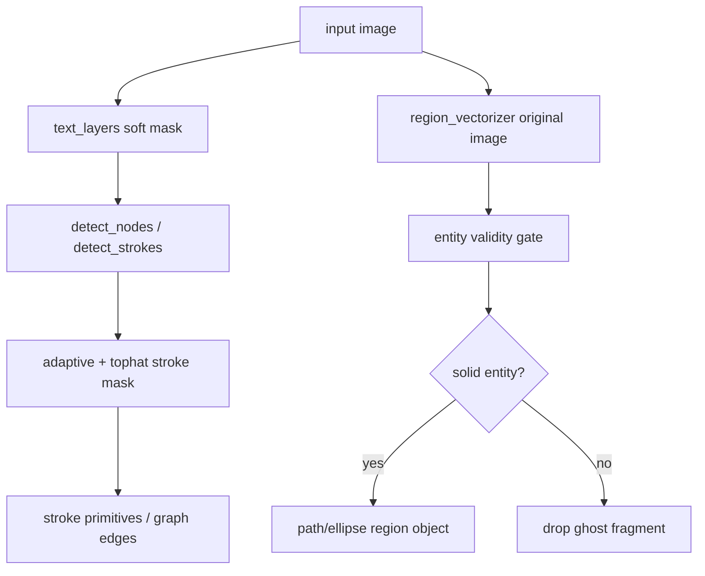

# 变更提案: entity-validity-and-topology-repair

## 元信息
```yaml
类型: 修复/优化
方案类型: implementation
优先级: P0
状态: 已确认
创建: 2026-03-12
```

---

## 1. 需求

### 背景
最新一轮 SVG 拖拽验收表明，第十轮虽然恢复了大型椭圆/圆形容器，但对象层与图层策略仍存在三处核心断裂：
- `stroke_detector.py` 在淡色半透明背景上的深灰细线检测不足，内部拓扑真实丢失。
- `region_vectorizer.py` / `segment.py` 缺少“有效实体”约束，背景残渣与误注入小块被继续矢量化，形成幽灵色块。
- 文本图层分离仍通过矩形蒙版直接切割底图，导致文字框附近图形被咬坏。

### 目标
- 为 `region_vectorizer.py` 与 `segment.py` 引入“有效实体”过滤，禁止对白底/透明背景残渣做挖孔和矢量化。
- 让 `stroke_detector.py` 强制使用局部自适应增强路径，恢复半透明背景内部的低对比网络连线。
- 调整 `pipeline.py` / `text_layers.py` / `ocr.py` 的文本处理策略，保证 OCR 只作为覆盖层，不再物理切割底图。
- 使用 `picture/a22efeb2-370f-4745-b79c-474a00f105f4.png` 与 `picture/F2.png` 重新导出 SVG，供人工验收图层结构。
- 保持现有对象驱动 pipeline、connector/fan 关系链和全量测试兼容。

### 约束条件
```yaml
时间约束: 本轮优先完成 P0，P1 只做必要文本链路修复，不主攻 star
性能约束: 保持 OpenCV/NumPy classical CV 管线，不引入外部模型
兼容性约束: 不破坏 RegionObject / StrokePrimitive / GraphEdge 接口
业务约束: 先修图层结构和拓扑正确性，再追求更复杂原语识别
```

### 验收标准
- [ ] 新增失败测试，覆盖幽灵碎片过滤、低对比连线恢复、文本蒙版不切底图。
- [ ] `a22...png` 重新导出后，大型椭圆保留，内部连线数量与拓扑明显恢复，幽灵色块减少。
- [ ] `F2.png` 重新导出后，低对比边与 arrow/stroke 主链保持可用。
- [ ] `pytest -q` 全量通过。

---

## 2. 方案

### 技术方案
采用“实体优先分层修复”方案：
1. `segment.py` 收紧 region proposal 兜底与 Hough 注入，降低背景/噪声进入 region 主链的概率。
2. `region_vectorizer.py` 增加有效实体判定，只允许面积适中、颜色稳定、闭合边界可信的色块进入 path/ellipse 输出。
3. `stroke_detector.py` 改为强制 `adaptiveThreshold + Top-Hat/局部对比增强` 双路径融合，增强淡色背景里的深灰细线。
4. `text_layers.py` / `pipeline.py` 调整文字去除策略：region 永远读原图，stroke/node 读软去字图层，绝不把 OCR 文本框当负掩膜切底图。
5. 先补失败测试，再做实现，最后对 `a22...png` / `F2.png` 和全量 pytest 回归。

### 影响范围
```yaml
涉及模块:
  - src/plot2svg/segment.py: region proposal 过滤与全局兜底抑制
  - src/plot2svg/region_vectorizer.py: 有效实体过滤与幽灵碎片抑制
  - src/plot2svg/stroke_detector.py: 局部自适应线条增强与融合
  - src/plot2svg/text_layers.py: 文本蒙版策略收紧
  - src/plot2svg/pipeline.py: 图层输入链路调整
  - tests/test_region_vectorizer.py: 幽灵碎片/实体过滤测试
  - tests/test_stroke_detector.py: 低对比拓扑恢复测试
  - tests/test_pipeline.py: 主样本图层结构回归
预计变更文件: 8
```

### 风险评估
| 风险 | 等级 | 应对 |
|------|------|------|
| 过滤过强误删真实小 region | 中 | 用面积、颜色方差、闭合度联合门控，而不是单阈值删小块 |
| adaptive/top-hat 放大噪声 | 中 | 保留连通域长度、细长率和 width 估计过滤 |
| 文本蒙版收紧后 OCR 周边干扰增加 | 中 | 将 region 与 stroke/node 分层使用不同输入，而不是统一改弱 |
| 牵连当前 ellipse 输出链 | 中 | 先补回归测试，优先保护 `a22` 大容器输出 |

---

## 3. 技术设计

### 架构设计


### 数据模型
| 字段 | 类型 | 说明 |
|------|------|------|
| `RegionObject.metadata.entity_valid` | `bool` | 当前区域是否通过有效实体过滤 |
| `RegionObject.metadata.reject_reason` | `str` | 若被过滤，记录原因用于调试 |
| `StrokePrimitive.metadata.detector_mode` | `str` | 记录具体低对比检测路径 |
| `TextGraphicLayers.text_mask` | `ndarray` | 改为更保守的软文本蒙版，而不是大矩形切割 |

---

## 4. 核心场景

### 场景: 幽灵背景碎片抑制
**模块**: `segment.py` + `region_vectorizer.py`
**条件**: 区域面积过小、颜色方差过低、边界不闭合或接近全局背景
**行为**: 直接丢弃，不进入 ellipse/path 导出
**结果**: 不再输出淡黄色锯齿块、缺口矩形等背景残渣

### 场景: 半透明底上的灰色网络线
**模块**: `stroke_detector.py`
**条件**: 线条对比度低、背景为彩色或半透明填充
**行为**: 强制局部增强 + adaptiveThreshold 路径，必要时融合 Top-Hat 响应
**结果**: 线条不再被全局阈值抹掉

### 场景: 文本框附近底图保真
**模块**: `text_layers.py` + `pipeline.py`
**条件**: 文本覆盖在 label box 或彩色实体上
**行为**: 仅对 stroke/node 使用软去字图层；region 保持原图分析
**结果**: OCR 不再把文字框周围底图切坏

---

## 5. 技术决策

### entity-validity-and-topology-repair#D001: 区域对象增加“有效实体”过滤，而不是继续放宽孔洞逻辑
**日期**: 2026-03-12
**状态**: ✅采纳
**背景**: 当前幽灵碎片的根因不是椭圆拟合，而是背景残渣本身被当作 region object 输出。
**选项分析**:
| 选项 | 优点 | 缺点 |
|------|------|------|
| A: 继续微调孔洞/ellipse 阈值 | 改动小 | 不能阻止背景残渣进入主链 |
| B: 先判定是否为有效实体，再决定 ellipse/path | 直击根因 | 需要新增过滤指标 |
**决策**: 选择方案 B
**理由**: 用户当前最严重的问题是幽灵碎片和背景残渣，不是椭圆本身。

### entity-validity-and-topology-repair#D002: 低对比线条检测改为局部自适应增强优先
**日期**: 2026-03-12
**状态**: ✅采纳
**背景**: `contrast+otsu` 在半透明淡色背景中对深灰细线仍会漏检。
**选项分析**:
| 选项 | 优点 | 缺点 |
|------|------|------|
| A: 保留 Otsu 主导，仅弱化阈值 | 实现简单 | 对复杂背景仍不稳 |
| B: adaptive/top-hat 强制进入主路径，再做噪声过滤 | 能恢复真实拓扑 | 需要额外噪声约束 |
**决策**: 选择方案 B
**理由**: 本轮验收的核心是“拓扑真恢复”，必须优先保证召回。

### entity-validity-and-topology-repair#D003: OCR 只作为覆盖层，禁止矩形负掩膜切底图
**日期**: 2026-03-12
**状态**: ✅采纳
**背景**: 当前文字层分离虽然不在 `ocr.py` 本体切图，但 `text_layers.py` 的矩形蒙版实质上完成了同样的破坏。
**选项分析**:
| 选项 | 优点 | 缺点 |
|------|------|------|
| A: 继续统一使用 `graphic_layer` | 简单 | 文字框附近底图持续受伤 |
| B: region/original 与 stroke-node/soft-graphic 分层使用 | 更稳 | 需要修改 pipeline 输入链 |
**决策**: 选择方案 B
**理由**: 这是最低风险且最符合当前主链的数据使用方式。
