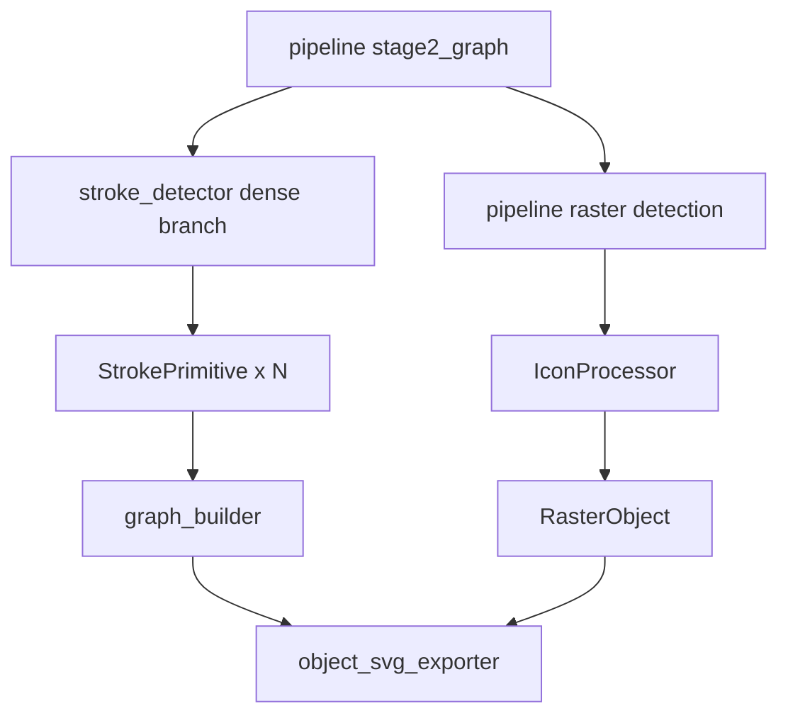

# 变更提案: round18-sandbox-integration

## 元信息
```yaml
类型: 修复/优化
方案类型: implementation
优先级: P0
状态: 执行中
创建: 2026-03-13
```

---

## 1. 需求

### 背景
主干项目在复杂科研图上仍存在三类核心退化：
- 高密度放射状线束会坍塌成实心色块，无法保持独立线段语义。
- 复杂图标会被错误多边形化，丢失原始细节。
- SVG 导出层级不稳定，导致图标、线条或文本被不正确遮挡。

本轮已在 `sandbox/` 中验证两段有效策略：
- `sandbox_line_fix.py`：通过骨架化、线段检测和放射状合并重建长线。
- `icon_processor.py`：通过复杂度体检将复杂图标降级为 Base64 `<image>`。

### 目标
- 将沙盒中已验证成功的密集线束重建逻辑安全移植到 `stroke_detector.py`。
- 抽取并接入复杂图标降级 helper，继续沿用主干现有 `RasterObject` 输出模型。
- 修正对象导出顺序，确保背景、图标、线条、节点、文本按正确层级输出。
- 用现有测试和一次端到端渲染验证主干集成结果。

### 约束条件
```yaml
时间约束: 当前轮以最小侵入集成为主，不做额外架构扩张
性能约束: 仅在高密度线束场景触发重建逻辑，避免普遍放大开销
兼容性约束: 保持 SceneGraph/RasterObject/减法管线现有协议稳定
业务约束: 不修改 sandbox 成果文件，不引入新的导出对象类型
```

### 验收标准
- [ ] 高密度放射状线束在主干中以多条 `StrokePrimitive`/`GraphEdge` 输出，不再坍塌成单个面状黑块。
- [ ] 复杂图标通过 `RasterObject` 以 Base64 `<image>` 导出，且不会再进入区域矢量化流程。
- [ ] 对象导出顺序调整为 `Region -> Raster -> Edge/Stroke -> Node -> Text`。
- [ ] 新增/更新测试覆盖线束重建、复杂图标降级和导出顺序。

---

## 2. 方案

### 技术方案
采用“最小侵入集成”：
- 保留现有 `pipeline.py` 的减法式调度和 `RasterObject` 模型，不新建 `IconObject`。
- 在 `stroke_detector.py` 中引入密集线束专用分支：
  - 复用现有 adaptive threshold 和 skeleton 能力。
  - 对高密度 stroke crop 追加 Hough/LSD 检测、斜率聚类、共线合并和放射约束。
  - 允许单个 `stroke` 节点拆出多条 `StrokePrimitive`。
- 将复杂图标复杂度评估与 Base64 编码抽为共享 helper，由 `pipeline._detect_raster_objects()` 复用。
- 在 `object_svg_exporter.py` 中调整输出顺序，并补齐多 primitive 场景下的覆盖关系。

### 影响范围
```yaml
涉及模块:
  - stroke_detector.py: 接入密集线束重建与多 primitive 输出
  - graph_builder.py: 修正多 primitive 场景下的 edge id 生成
  - pipeline.py: 复用共享 icon helper，保持减法管线接入
  - object_svg_exporter.py: 修正对象导出层级
  - 新增 icon_processor.py: 承载复杂图标体检和 Base64 编码
  - tests/: 增补线束重建、复杂图标降级、导出顺序测试
预计变更文件: 6-8
```

### 风险评估
| 风险 | 等级 | 应对 |
|------|------|------|
| 多条 primitive 共用一个 `node_id` 导致 edge id 冲突 | 高 | 在 `graph_builder.py` 改为基于 `primitive.id` 生成唯一 edge id |
| 高密度线束判定过宽，误伤普通连线 | 中 | 仅在高填充率/高骨架密度区域启用重建分支，并保留原路径回退 |
| 复杂图标误判为普通 region | 中 | 保持现有面积约束，同时加入 contour/variance/significant color 组合阈值 |
| 导出顺序调整影响现有测试 | 低 | 先补测试，再按对象层级精确调整 |

---

## 3. 技术设计

### 架构设计


### 数据模型
| 字段 | 类型 | 说明 |
|------|------|------|
| `StrokePrimitive.id` | `str` | 单个重建线段的唯一 id，可带序号后缀 |
| `StrokePrimitive.node_id` | `str` | 保留原始 `stroke` 节点 id，用于回填与抹除 |
| `RasterObject.metadata` | `dict` | 记录 contour/variance/significant_colors 等复杂度指标 |

---

## 4. 核心场景

### 场景: 高密度放射线重建
**模块**: `stroke_detector.py`
**条件**: 某个 `stroke` 区域骨架密度高、填充率高、局部路径明显碎裂
**行为**: 触发密集线束重建逻辑，输出多条合并后的长线 primitive
**结果**: 后续 `graph_builder` 和 SVG 导出获得分离的长线，而不是单个黑色面片

### 场景: 复杂图标降级
**模块**: `pipeline.py` / `icon_processor.py`
**条件**: 区域复杂度超过阈值或被标记为 `raster_candidate`
**行为**: 直接编码原图裁剪区域为 Base64 PNG，生成 `RasterObject`
**结果**: 图标保真保留，区域矢量化阶段跳过该对象

### 场景: 图层正确导出
**模块**: `object_svg_exporter.py`
**条件**: SceneGraph 同时包含 region、raster、edge、node、text
**行为**: 按统一层级顺序输出 SVG 片段
**结果**: 背景在底层，图标与线条不被节点或背景错误遮挡，文本位于最顶层

---

## 5. 技术决策

### round18-sandbox-integration#D001: 采用最小侵入集成而非新增 IconObject
**日期**: 2026-03-13
**状态**: ✅采纳
**背景**: 主干已有 `RasterObject` 和减法管线，若再引入 `IconObject` 会扩大协议面和迁移成本。
**选项分析**:
| 选项 | 优点 | 缺点 |
|------|------|------|
| A: 保留 `RasterObject` 并抽共享 helper | 改动面小，能直接复用现有导出与 JSON 协议 | 语义上仍以 raster fallback 命名，而非专门 icon 类型 |
| B: 新增 `IconObject` | 语义更显式 | 需要修改 SceneGraph、导出、序列化和兼容逻辑，风险更高 |
**决策**: 选择方案 A
**理由**: 本轮目标是把沙盒成功逻辑安全并回主干，优先保证回归风险最小。
**影响**: `pipeline.py`、`scene_graph.py` 使用现有 `RasterObject`，只新增共享 helper。
