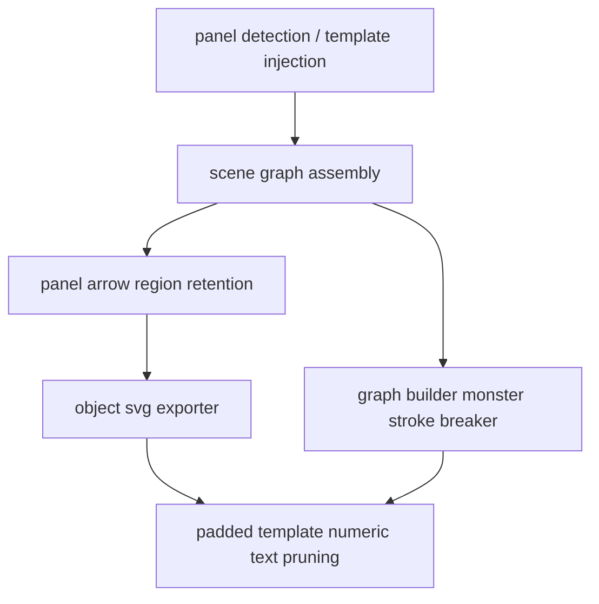

# 变更提案: round27-outlier-pruning

## 元信息
```yaml
类型: 修复/优化
方案类型: implementation
优先级: P0
状态: 已确认
创建: 2026-03-17
```

---

## 1. 需求

### 背景
Round 26 已经基本消除了黑块遮挡和 Base64 图层，但最终 SVG 仍然暴露出三类结构性噪点：
- `svg-template` 附近仍残留 `1.0`、`0.8` 之类的坐标轴数字文本，污染右侧图表区域。
- 图构建链路仍缺少“物理级熔断”，异常跨度、异常宽度的 monster stroke 仍可能穿透到最终导出。
- 跨面板粗体面状箭头虽然已有检测入口，但召回链路不够刚性，存在被误降级为普通连线或被下游过滤的风险。

### 目标
- 在模板注入区域外围 25px 范围内，强制清除数值型/刻度型幽灵文本。
- 在 `graph_builder` 入口加入全局异常线段硬熔断，禁止 monster stroke 进入 edge 导出链路。
- 强化跨面板粗体箭头的语义召回，确保其以 `panel_arrow` 的填充 region 形式保留，而不是退化为细线或噪点。

### 约束条件
```yaml
时间约束: 本轮按专项止血策略实施，不展开新的大范围重构
性能约束: 继续基于现有 OpenCV/SceneGraph 管线，避免引入额外重型依赖
兼容性约束: 不破坏既有 scene_graph/export_svg 数据接口；优先在现有字段上补充判定
业务约束: 不再通过阈值微调解决问题，改用版式与语义规则硬拦截
```

### 验收标准
- [ ] 模板区域向外膨胀 25px 后，落入其中的纯数字/刻度文本不再出现在最终 SVG 中。
- [ ] 任何普通拓扑连线若包围盒面积超过全图 15%、或对角线跨度超过画布对角线 50%、或线宽大于 15，必须在图构建阶段被直接丢弃。
- [ ] 跨面板粗体箭头在最终 SVG 中继续作为带原填充色的 `panel_arrow` 区域保留，不被降级成细线。
- [ ] 针对上述三项规则的回归测试补齐并通过。
- [ ] 生成新的 `outputs/end_to_end_flowchart_round27/final.svg` 供人工验收。

---

## 2. 方案

### 技术方案
采用“三点定向闭环”方案：
1. 在 `object_svg_exporter.py` 上扩展模板邻域文本裁剪逻辑，新增 25px padded template pruning，仅对数字/刻度/单位型文本做激进删除，避免误伤正文标签。
2. 在 `graph_builder.py` 的 edge 组装入口加入 monster stroke breaker，按面积、跨度、线宽三条硬规则直接丢弃异常 stroke，而不是再做降级导出。
3. 在 `pipeline.py` 中强化 `panel_arrow` 检测结果的保活链路，确保跨面板粗体面状箭头以 region 节点进入 scene graph，并避开 stroke 降维链路。

### 影响范围
```yaml
涉及模块:
  - src/plot2svg/object_svg_exporter.py: 模板邻域数值文本清理规则增强
  - src/plot2svg/graph_builder.py: monster stroke 全局熔断
  - src/plot2svg/pipeline.py: panel_arrow 召回与保活链路加固
  - tests/test_export_svg.py: 模板近邻数字文本清理测试
  - tests/test_graph_builder.py: monster stroke 丢弃测试
  - tests/test_pipeline.py: panel_arrow 召回/保留测试
预计变更文件: 6
```

### 风险评估
| 风险 | 等级 | 应对 |
|------|------|------|
| 模板周边正文文本被误删 | 中 | 仅对纯数字、浮点数、刻度短文本和常见单位模式触发 padded pruning |
| 强熔断误杀真实长连线 | 中 | 同时使用面积、跨度、线宽联合判定，并限定“普通 topology stroke”路径 |
| panel_arrow 召回后被其他过滤规则覆盖 | 中 | 在 pipeline 中写入显式 `shape_hint`，并补导出回归测试锁定链路 |

---

## 3. 技术设计

### 架构设计


### 数据模型
| 字段 | 类型 | 说明 |
|------|------|------|
| shape_hint | str | 标记 `panel_arrow`、`svg_template`、`raster_candidate` 等导出语义 |
| metadata.route_degraded | bool | 现有字段，保留用于识别已降级路由的边 |
| bbox | list[int] | 用于模板 padding 查询、monster stroke 面积/跨度计算 |

---

## 4. 核心场景

### 场景: 模板图表近邻刻度清理
**模块**: object_svg_exporter
**条件**: scene graph 中存在 `svg_template` 节点，且模板附近有 OCR 文本节点
**行为**: 将模板 bbox 向外扩张 25px，识别其中的数字/刻度/单位型文本并丢弃
**结果**: 热图、生存曲线等模板周围不再残留 `1.0`、`0.8` 等幽灵文本

### 场景: 巨型异常线段熔断
**模块**: graph_builder
**条件**: stroke 进入 edge 构建入口
**行为**: 按面积、跨度、线宽三条规则做全局 sanity check，不合格则直接 drop
**结果**: 全图巨型黑色折线或异常粗线无法进入最终 SVG

### 场景: 跨面板面状箭头召回
**模块**: pipeline
**条件**: 两个 panel 之间检测到高填充、明显方向性的厚实色块箭头
**行为**: 强制标记为 `panel_arrow` region，并绕过普通 stroke 降级逻辑
**结果**: 蓝色、紫色、橙色大箭头在最终 SVG 中以填充多边形形式保留

---

## 5. 技术决策

### round27-outlier-pruning#D001: 采用三点定向闭环而非大范围前置重构
**日期**: 2026-03-17
**状态**: ✅采纳
**背景**: 用户本轮目标是专项清除 Round 26 暴露出的离群噪点，而不是继续做大范围架构改写。需要优先用最小侵入方式止血并生成可验收产物。
**选项分析**:
| 选项 | 优点 | 缺点 |
|------|------|------|
| A: 三点定向闭环 | 直接覆盖 Round 27 三个验收点，回归面小，落地快 | 仍属于规则加固，不是彻底前置重构 |
| B: 导出端主导清洗 | 改动集中，开发速度快 | 过度依赖事后补救，对 panel_arrow 语义召回不稳 |
| C: 前置分类重排 | 长期架构更整洁 | 改动面大，回归风险高，不适合本轮专项止血 |
**决策**: 选择方案A
**理由**: 方案 A 与用户确认后的优先级完全一致，能够以最小改动同时解决模板近邻数字残留、monster stroke 漏网和 block arrow 召回三个核心问题。
**影响**: 影响 `object_svg_exporter.py`、`graph_builder.py`、`pipeline.py` 及对应测试。
